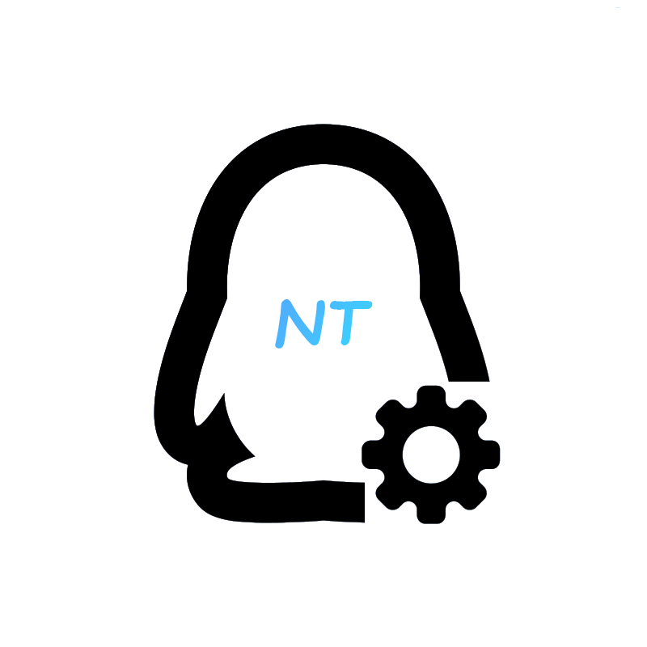

  

  <h3>Yui 机器人</h3>
   

----

  这是适用于Telecord的Yui机器人
  

   

## 介绍

基于 Yui 的机器人框架

## 实现的功能

请看这里：[功能](./docs/feature.md)

## 移除校验

请看这里：[校验](./docs/patch.md)

## 开发

获取当前项目，对它进行进一步开发，请阅读[开发文档](./docs/dev.md)

常用命令：

- `pnpm run yui:install`
- `pnpm run yui:dev`
- `pnpm run yui:build`
- `pnpm run yui:nodestart`
- `pnpm run ui:start`
- `pnpm run ui:start-log-file`

当前目录约定：

- 启动与运行时初始化优先查看 `src/bootstrap/**`
- HTTP / WS / OneBot 装配优先查看 `src/adapters/**`
- 动作用例与注册优先查看 `src/app/**`
- `src/onebot`、`src/server`、`src/http` 中多数文件已逐步退化为兼容入口

更多结构说明见：[重构计划](./docs/refactor-plan.md) 与 [迁移清单](./docs/refactor-migration-checklist.md)

## 注意

NodeJs版本要与官方客户端一致。目前是`v20.18.1`。
