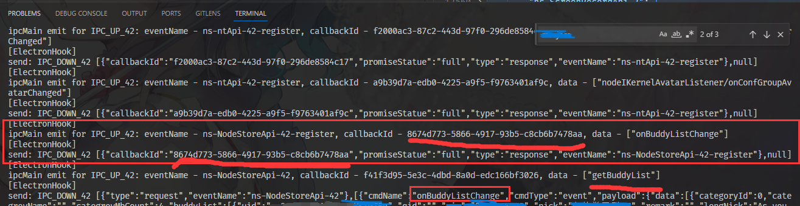

# 一、开发准备

本节介绍如何搭建基础的开发环境。

## 1.获取项目源码及初始化

  1. 命令行执行：`https://github.com/cuit-edu-cn/ntqq-bot.git`
  2. 进入项目：`cd ntqq-bot`
  3. 安装包：`pnpm install`

## 2. 获取QQ

  1. 打开一个Release页面
  2. 根据页面中完整包的链接，下载完整包
  3. 下载Release中的`skip_file_check`文件
  4. ***解压完整包*** 到任意文件夹，移动其中的Files目录中的文件到 **项目** 的`ntqq`目录下（注意，**不能**将文件夹下的文件加入git版本控制）

      大致结构如下：
      ```
      Yukihana
      ├─ntqq
      │  ├─lib
      │  ├─locales
      │  ├─obj
      │  └─resources
      ├─src
      ├─tools
      ....
      ```
  5. 删除`ntqq/QQ.exe`，将`skip_file_check`复制到ntqq文件夹中并重命名为`QQ.exe`。（就是替换QQ.exe）

## 3. 验证QQ启动文件替换的结果

  1. 打开文件`ntqq/resources/app/app_launcher/index.js`
  2. 在文件结尾加上注释符号`//`
  3. 启动QQ.exe
  4. 正常启动说明准备工作完成；否则会提示“资源损坏”。

# 二、开发介绍

## 1. 运行

  1. 执行命令 `pnpm run dev`，开始编译ts文件
  2. 生成的文件在 `ntqq/resources/app/app_launcher/index.js`
  3. 启动QQ，执行`ntqq/QQ.exe`

## 2. 后续开发

  1. 修改ts代码会自动编译
  2. 要应用更新需要关闭QQ，重新启动
  3. 有时代码错误导致QQ崩溃，需要在任务管理器中杀掉进程

# 三、开发

此处以获取好友列表为例

## 1. 找出功能的流程

  1. 打开QQ界面
  2. 点击 联系人 -> 好友管理器
  3. 使用好友名称搜索日志
  4. 观察日志：

      

  5. 可以发现，它先注册一个`onBuddyListChange`的订阅；

      然后，发送`getBuddyList`触发这个订阅；

      最后，产生了一条不带callbackid的推送。

## 2. 实现功能流程

  相关代码在：[getFriendList](../src/onebot/actions/friend.ts)

  1. 通过 `sendEvent` 先订阅 `onBuddyListChange` 事件
  2. 再通过 `registerEventListener` 注册一次性的好友列表变更事件 `onBuddyListChange`，用来接收推送
  3. 最后，通过 `sendEvent` 发送 `getBuddyList` 操作触发好友列表变更事件

## 3. 注册Onebot的动作处理

  相关代码在：[initFriend](../src/onebot/actions/friend.ts)
  
  在这个函数中，通过 `registerActionHandle` 来注册动作调用函数。
