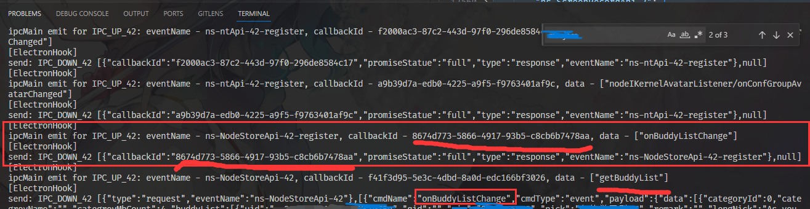

# 一、开发准备

本节介绍如何搭建基础的开发环境。

## 1.获取项目源码及初始化

  1. 命令行执行：`https://github.com/project-yui/Yui.git`
  2. 进入项目：`cd Yui`
  3. 安装npm包：`pnpm install`

## 2 安装环境

### 2.1 使用脚本安装

1. 执行 `pnpm run yui:install`
2. 执行 `pnpm run yui:dev`
3. 执行 `pnpm run yui:nodestart`

### 2.2 手动安装

[参考此处](./dev-manual.md)

# 二、开发介绍

## 1. 运行

  1. 执行命令 `pnpm run yui:dev`，开始监听并编译 TypeScript
  2. Node 运行入口会构建到 `program/index.js`
  3. 启动无 UI 界面的 Yui，执行 `pnpm run yui:nodestart`
  4. 启动有 UI 界面的 Yui，执行 `pnpm run ui:start`
  5. 启动有 UI 界面并保存日志的 Yui，执行 `pnpm run ui:start-log-file`（分析接口行为使用）

## 2. 关于后续开发

  1. 修改ts代码会自动编译
  2. 要应用更新需要关闭QQ，重新启动
  3. 有时代码错误导致QQ崩溃，需要在任务管理器中杀掉进程

# 三、开发

此处以获取好友列表为例

## 1. 找出功能的流程

  1. 打开QQ界面
  2. 点击 联系人 -> 好友管理器
  3. 使用好友名称搜索日志
  4. 观察日志：

      

  5. 可以发现，它先注册一个`onBuddyListChange`的订阅；

      然后，发送`getBuddyList`触发这个订阅；

      最后，产生了一条不带callbackid的推送。

## 2. 实现功能流程

  相关代码在：[getFriendList](../src/app/friend/friend-service.ts)

  1. 通过 `sendEvent` 先订阅 `onBuddyListChange` 事件
  2. 再通过 `registerEventListener` 注册一次性的好友列表变更事件 `onBuddyListChange`，用来接收推送
  3. 最后，通过 `sendEvent` 发送 `getBuddyList` 操作触发好友列表变更事件

## 3. 注册Onebot的动作处理

  相关代码在：[friendActionHandlers](../src/app/friend/register-friend-actions.ts)
  
  当前动作注册已经迁移到 `src/app/**` 下的薄注册层中，通过 `action handler map + registerActionHandlers` 的方式统一完成注册。
